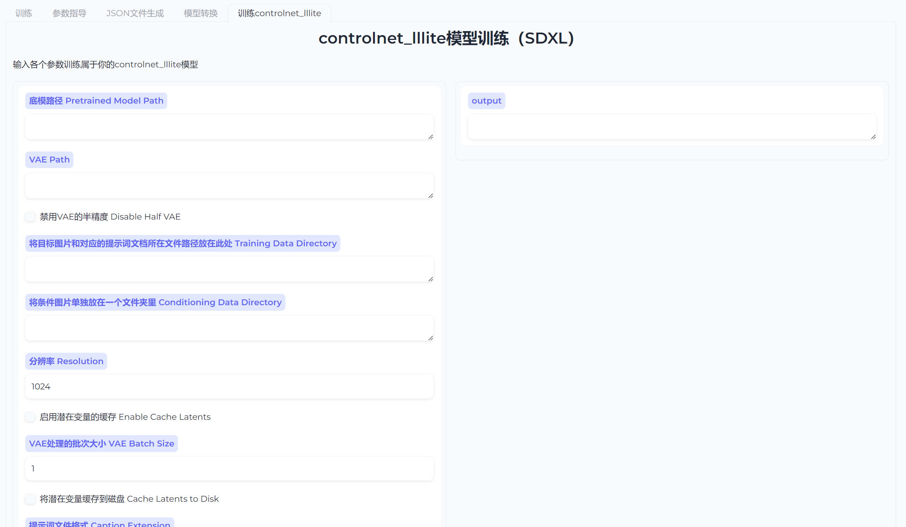
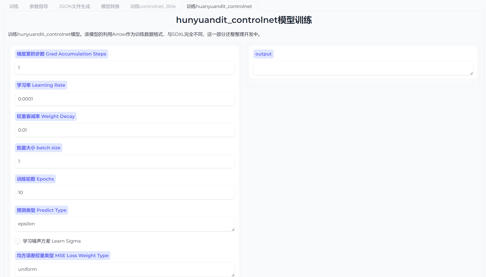

<p align="left">
    中文&nbsp;｜&nbsp;<a href="./readme.md">🌍 EN</a>&nbsp;
</p>


📃 **controlnet_train_webUI** (原 [controlnet_TrainingPackage](https://github.com/wusongbai139/controlnet_TrainingPackage))

<br>

---

<br>

## 目录  
 <br>

* [概述](#概述)
* [文件介绍](#文件介绍)
* [安装部署](#安装部署)
    * [环境推荐](#环境推荐)
    * [安装依赖](R#安装依赖)
    * [预训练模型下载](#预训练模型下载)
* [训练流程](#训练流程)
* [作者相关配套开源资源](#作者相关配套开源资源)
* [开发计划](#开发计划)
* [联系](#联系)

<br>

___

<br>

## 概述

<br>
🤖️ 利用diffusers编写的训练controlnet模型的项目，计划集成训练各种预训练模型的controlnet模型的方案。

📦 本项目包含：
* 训练界面
* 参数指导
* JSON文件生成
* 模型转换

✅ 项目特点：
* 方便实用，脚本或者UI界面都可以使用
* 支持训练SD1.5和SDXL的controlnet模型

<br>

___
<br>

## 文件介绍

| 文件       | 功能                             |
|-----------|-----------------------------------|
| gradio_train_cn.py     |     可以有交互操作的UI界面
| controlnet_train_15andXL.py     | 训练代码，可以直接使用训练模型      ||
| sdxl_train_control_net_lllite.py    | controlnet_lllite训练代码，可以直接使用      ||
| controlnet_train.ps1     | 训练脚本，可以在脚本中写入参数而使用  ||
| convert_model.py | 配合UI界面的转换模型文件 ||
| gen_json_file.py     | 配合UI界面的json文件生成文件   ||
| gen_json.py    | 可以独立使用的json文件生成文件   ||
| params_guidance.md    | 记录了各种参数           ||
| requirements.txt     | 记录环境依赖文件 |

<br>

___

<br>

## 安装部署
<br>

### 环境推荐
[](https://pypi.org/project/pypiserver/) 


### 安装依赖（推荐使用conda部署）
#### 一、SD15 and SDXL
1. 建立环境：```conda create --name controlnettrain python=3.10```
2. 激活环境：```conda activate controlnettrain```
3. 安装依赖：```pip install -r requirements.txt ```
4. 在终端中输入：```python gradio_train_cn.py``` 启动页面
5. （可选择）在激活的环境中输入：```pip install xformers ``` 启用xformers的内存高效注意力机制
6. 需要diffusers=0.30.0.dev0。步骤：
    1. cd 项目根目录文件夹
    2. 终端中输入：```git clone https://github.com/huggingface/diffusers```
    3. cd diffusers
    4. 激活环境后输入：```pip install .```
7. flash-attention的安装
    1. 方法（一）：
        - cd 你的项目文件根目录
        - ```git clone https://github.com/Dao-AILab/flash-attention.git```
        - cd flash-attention
        - python setup.py install
    2. 方法（二）：
        - 进入：https://github.com/Dao-AILab/flash-attention/releases
        - 在Assets中选择合适的版本，下载并放入到你的项目文件夹里
        - 执行：```pip install flash_attn-2.6.3+cu118torch2.cxx11abiTRUE-cp311-cp311-linux_x86_64.whl```（"flash_attn-2.6.3+cu118torch2.cxx11abiTRUE-cp311-cp311-linux_x86_64.whl" 指的是你下载文件的名字）

#### 二、HunyuanDit
1. 激活环境：```conda activate controlnettrain```
2. 安装依赖：
    ```
    pip install deepspeed  peft matplotlib==3.7.5 onnxruntime_gpu==1.16.3 opencv-python==4.8.1.78
    cd IndexKits
    pip install -e . 
    ```

<br>

模型训练页面：

参数指导页面：

模型转换页面：

JSON文件生成页面

controlnet_lllite模型训练页面

HunyuanDit_controlnet模型训练页面


<br>

### 预训练模型下载

1. SD15模型
- 模型下载地址：[https://huggingface.co/runwayml/stable-diffusion-v1-5/tree/main](https://huggingface.co/runwayml/stable-diffusion-v1-5/tree/main)
- 需要下载的文件：
    ```
    stable-diffusion-v1-5
    |-- feature_extractor
    |-- safety_checker
    |-- scheduler
    |-- text_encoder
    |-- tokenizer
    |-- unet
    |-- vae
    ```
2. SDXL模型
- 模型下载地址：[https://huggingface.co/stabilityai/stable-diffusion-xl-base-1.0/tree/main](https://huggingface.co/stabilityai/stable-diffusion-xl-base-1.0/tree/main)
- 需要下载的文件：
    ```
    stable-diffusion-xl-base-1.0
    |-- scheduler
    |-- text_encoder
    |-- text_encoder_2
    |-- tokenizer
    |-- tokenizer_2
    |-- unet
    |-- vae
    ```
3. hunyuanDit
- 模型下载：
    ```
    huggingface-cli download Tencent-Hunyuan/HYDiT-ControlNet-v1.1 --local-dir ./HunyuanDiT-v1.1/t2i/controlnet
    huggingface-cli download Tencent-Hunyuan/Distillation-v1.1 ./pytorch_model_distill.pt --local-dir ./HunyuanDiT-v1.1/t2i/model
    ```

<br>

___

<br>

## 训练流程

<br>

1. 制作训练集，准备目标图片、条件图片与提示词文件；
- 目标图片是指你期望用模型生成什么图片，放在image文件夹中；
- 条件图片是指从原始图片中提取的特征图片，放在conditioning_image文件夹中；
- 提示词文件是与目标图片匹配的提示词文件，放在text文件夹中。
- 文件夹命名一定要准确。
2. 在webUI中使用JSON文件生成工具制作train.json文件；
4. 在训练页面中填写参数；
5. 开始训练；
6. 如果感觉得到的模型很大，可以在模型转换页面中转换模型。

<br>

___
<br>

## 作者相关配套开源资源


1. 开源训练集
    - 数据集3000张[qrcode_xl_test_data] https://huggingface.co/datasets/songbaijun/qrcode_xl_test_data
        ```
        qrcode_xl_test_data
        |_ conditioning_image 3000
        |_ image 3000
        |_ text 3000
        ```

2. 使用[qrcode_xl_test_data]训练的qrocde_xl_test模型
    - 链接：https://huggingface.co/songbaijun/qrocde_xl_test_3000
    - 权重为2，会有效果

3. 训练教程 https://www.bilibili.com/video/BV1qsWYeuEFy/?spm_id_from=333.999.0.0

<br>
___


<br>

## 开发计划

<br>

- controlnet 
  - [x] SD15
  - [x] SDXL
    - [x] controlnet_lllite（轻量版本）
  - [x] HunyuanDit
  - [ ] SD3
  - [ ] Kolors
- train
  - [ ] 一键安装包
  - [ ] 更多新功能（优化器、参数等）
- data
  - …

<br>

___

<br>

## 联系：

<br>
ai松柏君

📧：aisongbaijun@163.com 

X：[](https://x.com/songbai20)

B站主页：https://space.bilibili.com/523893438?spm_id_from=333.1007.0.0