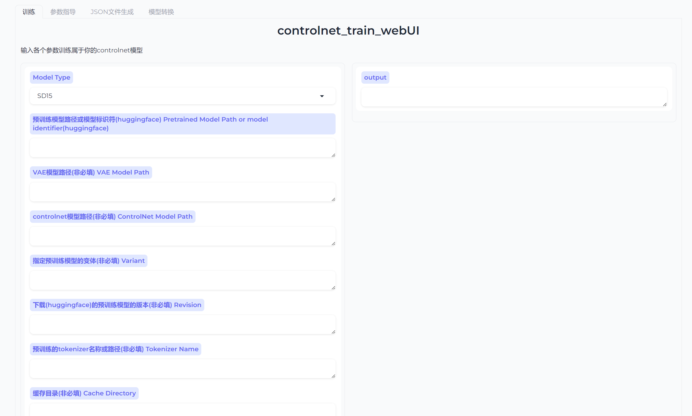
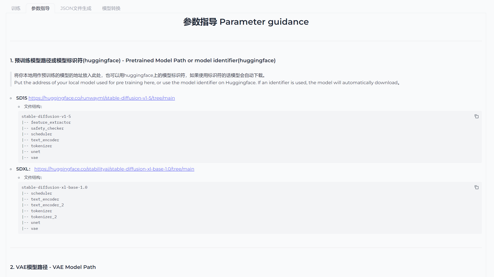
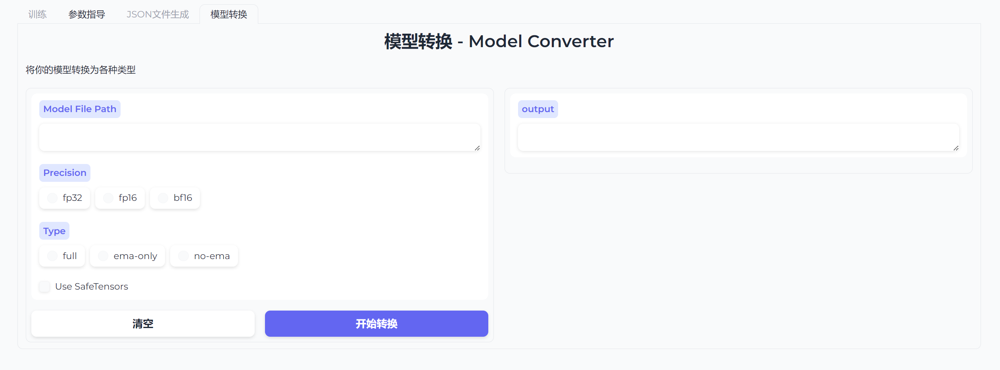
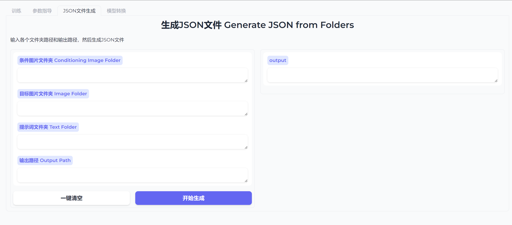
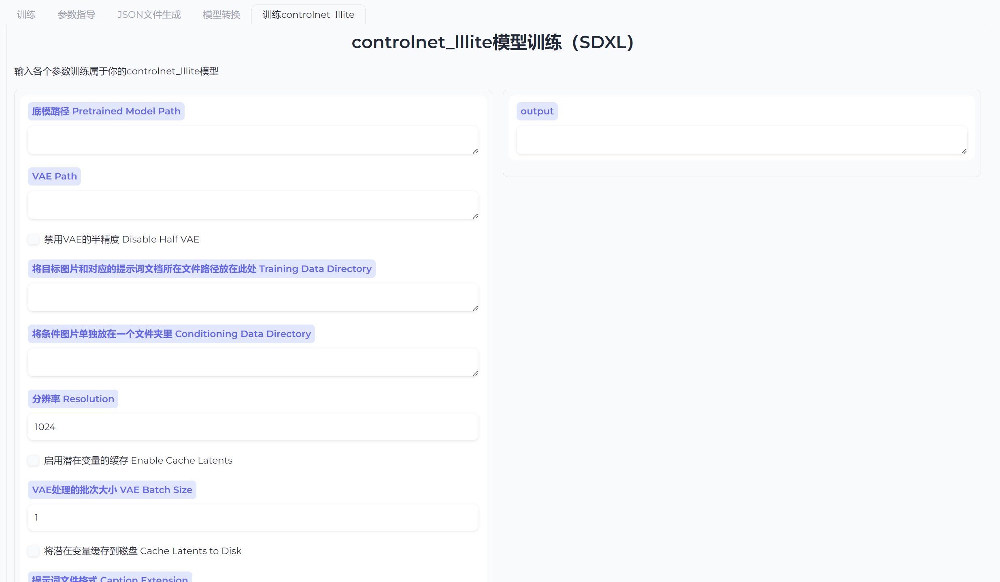
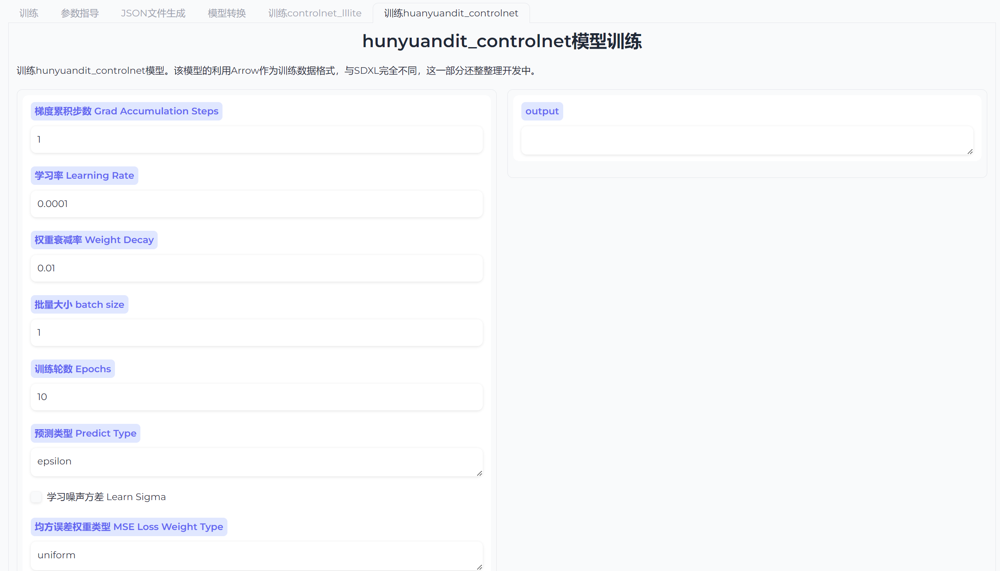
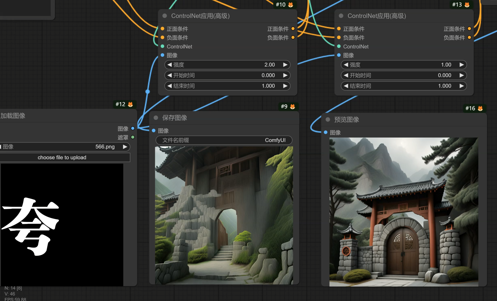

<p align="left">
    🌍 EN&nbsp;｜&nbsp;<a href="./readme.md">中文</a>&nbsp;
</p>

📃 **controlnet_train_webUI** (Original project address： [controlnet_TrainingPackage](https://github.com/wusongbai139/controlnet_TrainingPackage))

<br>

---

<br>

## Directory  
 <br>

* [Overview](#overview)
* [Document Introduction](#document-introduction)
* [Deployment](#deployment)
    * [Environment](#environment)
    * [Install](#install)
    * [Model Download](#model-download)
* [Training](#training)
* [Author related supporting open source resources](#author-related-supporting-open-source-resources)
* [Plan](#plan)
* [Contact](#contact)

<br>

___

<br>

## Overview

<br>
🤖️ The project of training the ControlNet model using diffusers is planned to integrate the training of various pre trained ControlNet models.

📦 This project includes:
* Training interface
* Parameter guidance
* JSON file generation
* Model conversion

✅ Project features:
* Convenient and practical, both scripts and UI interfaces can be used
* Support the training of ControlNet models for SD1.5 and SDXL

<br>

___
<br>

## Document Introduction

| file name     | function                             |
|-----------|-----------------------------------|
| gradio_train_cn.py     |     UI interface with interactive operation面
| controlnet_train_15andXL.py     | Training code can be directly used to train the model      ||
| sdxl_train_control_net_lllite.py    | controlnet_lllite training code, can be directly used      ||
| controlnet_train.ps1     | Training script, which can be used by writing parameters in the script  ||
| convert_model.py | Convert model files in conjunction with the UI interface ||
| gen_json_file.py     | Generate a JSON file in conjunction with the UI interface   ||
| gen_json.py    | Generate files from JSON files that can be used independently   ||
| params_guidance.md    | Recorded various parameters   ||
| requirements.txt     | Record environment dependency files |

<br>

___

<br>

## Install
<br>

### Environment
[](https://pypi.org/project/pypiserver/) 


### Install
#### 一、SD15 and SDXL
(Recommended to use conda deployment)
1. Create environment: ```conda create -- name controlletrain Python=3.10```
2. Activation environment: ```conda activate control net rain```
3. Install other dependencies: ```pip install - r requirements. txt```
4. Enter: ```python gradio_train_cn.py startup page in the terminal```
5. (Optional)Enter ```pip install xforms``` in the activated environment to enable the memory efficient attention mechanism of xforms
6. (Note!) diffusers=0.30.0.dev0 is required :
    1. cd [ your project root directory folder ]
    2. Enter ```git clone https://github.com/huggingface/diffusers ``` in the terminal
    3. cd diffusers
    4. After activating the environment, enter: ```pip install .```
7. Installation of flash-attention
    1. Method (I):
        - cd your project file root directory
        - ```git clone https://github.com/Dao-AILab/flash-attention.git```
        - cd flash-attention
        - python setup.py install
    2. Method (II):
        - Go to: https://github.com/Dao-AILab/flash-attention/releases
        - Select the appropriate version in Assets, download and put it in your project folder
        - Execute: ```pip install flash_attn-2.6.3+cu118torch2.cxx11abiTRUE-cp311-cp311-linux_x86_64.whl```("flash_attn-2.6.3+cu118torch2.cxx11abiTRUE-cp311-cp311-linux_x86_64.whl" is the name of the file you downloaded)

#### 二、HunyuanDit
1. Activation environment：```conda activate controlnettrain```
2. Install other dependencies：
    ```
    pip install deepspeed  peft matplotlib==3.7.5 onnxruntime_gpu==1.16.3 opencv-python==4.8.1.78
    cd IndexKits
    pip install -e . 
    ```

<br>

Model Training Page：

Parameter guidance page：

Model Conversion Page：

JSON file generation page：

controlnet_lllite model training page

HunyuanDit_controlnet training page


<br>


### Model Download

1. SD15
- Model download address：[https://huggingface.co/runwayml/stable-diffusion-v1-5/tree/main](https://huggingface.co/runwayml/stable-diffusion-v1-5/tree/main)
- Files that need to be downloaded：
    ```
    stable-diffusion-v1-5
    |-- feature_extractor
    |-- safety_checker
    |-- scheduler
    |-- text_encoder
    |-- tokenizer
    |-- unet
    |-- vae
    ```
2. SDXL
- Model download address：[https://huggingface.co/stabilityai/stable-diffusion-xl-base-1.0/tree/main](https://huggingface.co/stabilityai/stable-diffusion-xl-base-1.0/tree/main)
- Files that need to be downloaded：
    ```
    stable-diffusion-xl-base-1.0
    |-- scheduler
    |-- text_encoder
    |-- text_encoder_2
    |-- tokenizer
    |-- tokenizer_2
    |-- unet
    |-- vae
    -- model_index.json
    ```
3. 3. hunyuanDit
- Model download：
    ```
    huggingface-cli download Tencent-Hunyuan/HYDiT-ControlNet-v1.1 --local-dir ./HunyuanDiT-v1.1/t2i/controlnet
    huggingface-cli download Tencent-Hunyuan/Distillation-v1.1 ./pytorch_model_distill.pt --local-dir ./HunyuanDiT-v1.1/t2i/model
    ```

<br>

___

<br>

## Training

<br>

1. Create a training set, prepare target images, condition images, and prompt word files;
- The target image refers to what image you expect to be generated using the model and placed in the image folder;
- Conditional images refer to feature images extracted from the original image and stored in the conditioning_image folder;
- The prompt word file is a prompt word file that matches the target image and is placed in the text folder.
- Folder naming must be accurate.
2. Use a JSON file generation tool in the webUI to create a train.exe file;
4. Fill in the parameters on the training page;
5. Start training;
6. If you feel that the model is large, you can convert it on the model conversion page.

<br>

___

<br>

## Author related supporting open source resources


1. Open source training set https://huggingface.co/datasets/songbaijun/qrcode_xl_test_data
    - data sets[qrcode_xl_test_data] https://huggingface.co/datasets/songbaijun/qrcode_xl_test_data
        ```
        qrcode_xl_test_data
        |_ conditioning_image 3000
        |_ image 3000
        |_ text 3000
        ```

2. The qrocde-xx_test model trained using [qrcode-xx_test_data]
    - model：https://huggingface.co/songbaijun/qrocde_xl_test_3000
    - Weight of 2 will have an effect

<br>
___

___

<br>

## Plan

<br>

- controlnet
  - [x] SD15
  - [x] SDXL
    - [x] controlnet_lllite(Lightweight version)
  - [x] HunyuanDit
  - [ ] SD3
  - [ ] Kolors
- train
  - [ ] portable standalone build
  - [ ] More new features (optimizer, parameters, etc.)
- data
  - …

<br>

___

<br>

## Contact：

<br>
ai松柏君

📧：aisongbaijun@163.com 

X：[](https://x.com/songbai20)

B站主页：https://space.bilibili.com/523893438?spm_id_from=333.1007.0.0